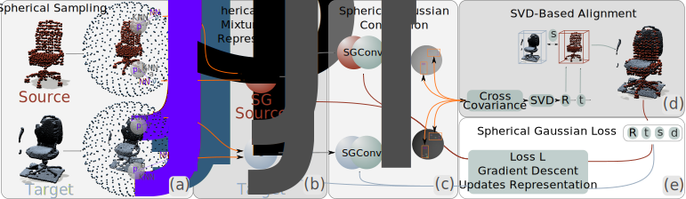

# SGPCR: 



# Abstract

Retrieving and aligning CAD models from databases with scanned real-world point clouds remains an important topic for 3D reconstruction.
Due to zero point-to-point correspondences between the sampled CAD model and the scanned real-world object, an information-rich representation of point clouds is needed.
We propose SGPCR, a novel method for representing 3D point clouds by Spherical Gaussians for efficient, stable, and rotation-equivariant representation.
We also propose a rotation-invariant convolution to improve the representation quality through a trainable optimization process.
In addition, we demonstrate the strengths of SGPCR-based point cloud representation using the fundamental challenge of shape retrieval and point cloud registration on point clouds with zero point-to-point correspondences.
Under these conditions, our approach improves registration quality by reducing chamfer distance by up to 90\% and rotation root mean square error by up to 86\% compared to the state of the art.
Furthermore, the proposed SGCPR is used for one-shot shape retrieval and registration and improves retrieval precision by up to 58\% over comparable methods.

# Citation

Please cite us using:

```tex
@inproceedings{SalihuSGPCR_2023,
	author = {Salihu, Driton and  Steinbach, Eckehard},
	title = {SGPCR: Spherical Gaussian Point Cloud Representation and its Application to Object Registration and Retrieval},
	booktitle = {The 2023 IEEE/CVF Winter Conference on Applications of Computer Vision (WACV 2023)},
	year = {2023},
	address = {Waikoloa, Hawaii USA},
	month = {Jan},
}
```

## NEWS

- Due to deadlines the release of the code will be slightly delayed (-> until hopefully end of December)
